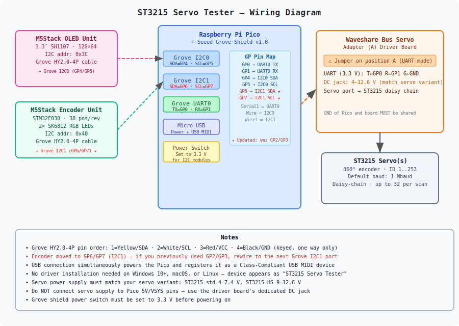

# Servo Tester — ST3215 · DXL MX (P1.0) · DXL X (P2.0)

A standalone servo configuration, control, and MIDI integration tool for **Waveshare ST3215**, **Dynamixel MX series (Protocol 1.0)**, and **Dynamixel X series (Protocol 2.0)** serial bus servos.  
Built on a **Raspberry Pi Pico (RP2040)** with a rotary encoder knob, OLED display, and USB MIDI — no PC required once flashed.



---

## Table of Contents

1. [Features](#features)
2. [Hardware](#hardware)
   - [Bill of Materials](#bill-of-materials)
   - [Hookup Table](#hookup-table)
   - [Wiring Notes](#wiring-notes)
3. [Supported Servo Protocols](#supported-servo-protocols)
4. [Screen Reference](#screen-reference)
   - [Navigation Controls](#navigation-controls)
   - [Screen Descriptions](#screen-descriptions)
5. [Software Setup](#software-setup)
   - [Prerequisites](#prerequisites)
   - [Build Environments](#build-environments)
   - [Project Setup](#project-setup-in-vscode--platformio)
   - [Building and Flashing](#building-and-flashing)
6. [Hardware Setup](#hardware-setup)
7. [Usage Guide](#usage-guide)
   - [First Boot](#first-boot)
   - [Protocol Selection](#protocol-selection)
   - [Bus Scanning](#bus-scanning)
   - [Live Control](#live-control)
   - [Configuration](#configuration)
   - [MIDI Mode](#midi-mode)
   - [Flash Diagnostics](#flash-diagnostics)
8. [MIDI Reference](#midi-reference)
9. [Persistent Storage](#persistent-storage)
10. [Servo Configuration Parameters](#servo-configuration-parameters)
11. [Fault Codes](#fault-codes)
12. [Serial Debug Commands](#serial-debug-commands)
13. [Project File Structure](#project-file-structure)
14. [External Documentation](#external-documentation)
15. [Troubleshooting](#troubleshooting)

---

## Features

### Servo Control
- **Three servo protocols** — ST3215 (STS/SMS), Dynamixel Protocol 1.0 (MX series RS-485), Dynamixel Protocol 2.0 (XH/XM/XD series RS-485); switchable at runtime from the menu
- **Multi-baud bus scan** — scan at any baud rate from the protocol's baud table, or run *Scan All* to sweep all rates and find servos regardless of their current setting
- **Scan abort** — long-press during any scan to stop early and keep found servos
- **Live control** — real-time position, speed, and acceleration adjustment
- **Full EPROM configuration** — Servo ID, Min/Max limits, Torque limit, Center offset, Mode (Servo/Wheel), Baud rate; changes staged and written on explicit Save
- **Wheel mode safety warning** — hardware-damage warning screen before enabling continuous rotation
- **Servo info** — two-page info screen: runtime values (position, voltage, temperature) and fault status (load, current, decoded fault flags)

### MIDI
- **USB MIDI device** — appears as Class-Compliant MIDI on Windows/macOS/Linux with no driver needed
- **USB CDC serial simultaneously** — debug output and serial commands available alongside MIDI on the same USB connection
- **Per-servo CC mapping** — assign any CC number and MIDI channel to each detected servo
- **Bidirectional** — inbound CC moves servos; outgoing CC reflects actual position in real time
- **Inverted mapping** — optionally invert the CC→position scaling per servo
- **IIR smoothing filter** — per-servo adjustable low-pass filter (0=off, 127=very slow)
- **Global CC parameters** — Speed, Acceleration, and Smoothing each mappable as MIDI CC
- **MIDI monitor** — scrollable ring buffer showing last 4 messages: CC, Note On/Off, Pitch Bend, Program Change, Aftertouch
- **MIDI panic** — sends CC 121 + CC 123 on all 16 channels

### System
- **Persistent configuration** — servo list, protocol, scan baud, torque, speed, acc, and all MIDI bindings saved to LittleFS; restored on boot without rescanning
- **Flash diagnostics screen** — inspect LittleFS health, file size, magic/version check, saved servo/MIDI counts
- **Status LED** — amber during boot, green when idle, amber when MIDI active (XIAO build only)

---

## Hardware

Two hardware configurations are supported, selected at compile time via the PlatformIO environment:

| Environment | Board | Display | Encoder |
|---|---|---|---|
| `env:pico` | Raspberry Pi Pico + Grove Shield | M5Stack OLED 1.3″ (SH1107, 64×128) on I2C0 | M5Stack Unit Encoder on I2C1 |
| `env:xiao_rp2040` | Seeed XIAO RP2040 + Expansion Board | SSD1306 128×64 on I2C (Wire) | M5Stack 8-Unit Encoder on same I2C bus |

### Bill of Materials (Pico + Grove Shield build)

| # | Part | Notes |
|---|------|-------|
| 1 | **Raspberry Pi Pico** (RP2040) | Headers pre-soldered recommended |
| 2 | **Grove Shield for Pi Pico v1.0** | Seeed Studio |
| 3 | **M5Stack Unit OLED 1.3″** (SH1107, 128×64) | I2C address 0x3C |
| 4 | **M5Stack Unit Encoder** (STM32F030, 30 pos/rev, RGB LED) | I2C address 0x40 |
| 5 | **RS-485 adapter board** | Auto-direction (TX-controlled); connects to UART0 |
| 6 | Servos: ST3215, MX-28R/64R, or XH/XM series | One or more, same bus |
| 7 | DC supply for servos (voltage per servo spec) | Shared GND with Pico mandatory |

---

### Hookup Table (Pico + Grove Shield)

| Signal | Pico GPIO | Grove Port | Connects to |
|--------|-----------|------------|-------------|
| OLED SDA | **GP4** | I2C0 | M5Stack OLED — SDA |
| OLED SCL | **GP5** | I2C0 | M5Stack OLED — SCL |
| Encoder SDA | **GP6** | I2C1 | M5Stack Encoder — SDA |
| Encoder SCL | **GP7** | I2C1 | M5Stack Encoder — SCL |
| Servo UART TX | **GP0** | UART0 T | RS-485 adapter — T |
| Servo UART RX | **GP1** | UART0 R | RS-485 adapter — R |
| Common GND | GND | Any GND | RS-485 adapter — G |

**I2C addresses:**

| Device | Address | Bus |
|--------|---------|-----|
| M5Stack OLED (SH1107) | `0x3C` | `Wire` (I2C0, GP4/GP5) |
| M5Stack Encoder | `0x40` | `Wire1` (I2C1, GP6/GP7) |

---

### Wiring Notes

**Grove Shield power switch** — set to **3.3 V** before connecting. Both OLED and Encoder are 3.3 V devices.

**RS-485 adapter** — use an auto-direction (TX-controlled) adapter with no separate DE/RE pins. The adapter automatically switches TX/RX based on UART TX line activity. Half-duplex operation means your TX bytes are echoed back to RX; the firmware handles this echo cancellation automatically for all three protocols.

**UART wiring is straight-through** — `GP0 (TX) → T`, `GP1 (RX) → R`. The adapter handles half-duplex bus arbitration.

**Shared ground is mandatory** — servo power supply, RS-485 adapter, and Pico must share a common GND.

**USB carries both MIDI and serial** — the Pico enumerates as a composite USB device: USB MIDI + USB CDC serial. Connect with any serial terminal at 115200 baud to see debug output and send commands while MIDI remains active.

---

## Supported Servo Protocols

Select the active protocol from **Home → Protocol**. The protocol and its last-used baud index are persisted across power cycles.

### ST3215 / STS / SMS (default)
Waveshare/Feetech serial bus servos. Uses the SCServo library. Factory baud: **1,000,000**.

| Index | Baud |
|---|---|
| 0 | 1,000,000 (factory default) |
| 1 | 500,000 |
| 2 | 250,000 |
| 3 | 128,000 |
| 4 | 115,200 |
| 5 | 76,800 |
| 6 | 57,600 |
| 7 | 38,400 |

### DXL MX — Protocol 1.0 (MX-28, MX-64, MX-106)
Dynamixel RS-485 MX series. Factory baud: **57,142** (register 34; Dynamixel's nominal "57600" = 2,000,000/35).

| Index | Actual baud | DXL register |
|---|---|---|
| 0 | 9,615 | 207 |
| 1 | 19,230 | 103 |
| 2 | **57,142** | **34** (factory default) |
| 3 | 100,000 | 19 |
| 4 | 117,647 | 16 |
| 5 | 200,000 | 9 |
| 6 | 250,000 | 7 |
| 7 | 1,000,000 | 1 |

> **Note:** Dynamixel Wizard shows "57600" but the actual UART rate is 57,142. The firmware uses the correct value to avoid framing errors.

### DXL X — Protocol 2.0 (XH430, XM430, XD430, XH540…)
Dynamixel RS-485 X series. Factory baud: **57,600** (register index 1).

| Index | Baud |
|---|---|
| 0 | 9,600 |
| 1 | **57,600** (factory default) |
| 2 | 115,200 |
| 3 | 1,000,000 |
| 4 | 2,000,000 |
| 5 | 3,000,000 |
| 6 | 4,000,000 |
| 7 | 4,500,000 |

> **DXL2 torque behaviour:** The XH/XM series locks EEPROM registers when torque is enabled. The firmware automatically disables torque when entering the Configure menu, and always starts Live Control with torque off — the user must explicitly enable it.

---

## Screen Reference

### Navigation Controls

| Action | Effect |
|--------|--------|
| **Turn knob** | Scroll menu / increment or decrement value when editing |
| **Short press** | Select item / enter edit mode / confirm edit |
| **Long press** | Cancel edit (restores previous value) / go back to Home |

---

### Screen Descriptions

| Screen | Access | Purpose |
|--------|--------|---------|
| **Home** | Boot / Long press from anywhere | Top-level menu with 9 items |
| **Select Protocol** | Home → Protocol | Choose ST3215 / DXL MX (P1.0) / DXL X (P2.0) |
| **Scan Baud Select** | Home → Scan Bus | Choose baud rate or Scan All |
| **Scanning…** | After selecting single baud | Progress bar ID 0–253; **Long press = stop early** |
| **Scan All Bauds** | Scan Baud Select → Scan All | Dual progress: outer=baud, inner=ID |
| **Select Servo** | Home → Select Servo | Scroll found IDs; short press to make active |
| **Live Control** | Home → Live Control | Real-time: Torque · Position · Speed · Acceleration |
| **Servo Info** | Home → Servo Info | Page 1: Online/Position/Voltage/Temp — short press for page 2 |
| **Faults** | Servo Info → Short press | Load %, Current (mA), decoded fault flags |
| **Configure** | Home → Configure | Edit EPROM parameters (7 rows) |
| **⚠ Wheel Mode** | Configure → Mode | Safety confirmation before enabling continuous rotation |
| **Confirm Save?** | Home → Save Changes | Summary of staged config; No / Yes |
| **Save Result** | After confirming save | OK or failure message |
| **MIDI Setup** | Home → MIDI Mode | Assign CC/channel/invert/smooth per servo |
| **MIDI Run** | MIDI Setup → Run | Live TX/RX indicators; Monitor and Panic rows |
| **MIDI Monitor** | MIDI Run → MIDI Monitor | Last 4 received MIDI messages |
| **Flash Diag** | Home → Flash Diag | LittleFS health, file size, saved counts |

---

## Software Setup

### Prerequisites

| Tool | Notes |
|------|-------|
| **VSCode** | [code.visualstudio.com](https://code.visualstudio.com) |
| **PlatformIO IDE extension** | Install from VSCode Extensions marketplace |

### Build Environments

```ini
[env:pico]          ; Raspberry Pi Pico + Grove Shield
board = pico

[env:xiao_rp2040]   ; Seeed XIAO RP2040 + Expansion Board  (default)
board = seeed_xiao_rp2040
```

Select the active environment in VS Code's bottom status bar, or:
```
pio run -e pico -t upload
```

### Project Setup in VSCode / PlatformIO

1. Open the project folder (`File → Open Folder` → directory with `platformio.ini`).
2. PlatformIO auto-detects the project and installs dependencies.
3. Library dependencies (fetched automatically):

```ini
lib_deps =
    https://github.com/workloads/scservo.git
    adafruit/Adafruit GFX Library @ ^1.11.9
    adafruit/Adafruit SH110X    @ ^2.1.10
    adafruit/Adafruit SSD1306   @ ^2.5.9
    adafruit/Adafruit TinyUSB Library @ ^3.1.0
    fortyseveneffects/MIDI Library @ ^5.0.2
```

4. Platform: **Earle Philhower RP2040 Arduino core** via maxgerhardt's platform wrapper.
5. Both environments run at **120 MHz** (`board_build.f_cpu = 120000000L`).
6. USB enumerates as composite MIDI + CDC:
```ini
build_flags =
    -D USE_TINYUSB
    -D CFG_TUD_CDC=1
    -D PICO_STDIO_UART=0
```

### Building and Flashing

**Method 1 — PlatformIO toolbar**
1. Select the correct environment in the bottom status bar (`env:pico` or `env:xiao_rp2040`).
2. Click **✓ Build**.
3. Hold **BOOTSEL** on the Pico, plug in USB, release.
4. Click **→ Upload** — PlatformIO uses `picotool`.

**Method 2 — Manual drag-and-drop**
1. Build the project. Output: `.pio/build/pico/firmware.uf2`
2. Enter BOOTSEL mode; copy `firmware.uf2` to the `RPI-RP2` drive.

---

## Hardware Setup

1. Seat the Pico on the Grove Shield (USB connector toward the shield edge).
2. **Set Grove Shield power switch to 3.3 V.**
3. Connect OLED (Grove cable) to **I2C0** port.
4. Connect Encoder (Grove cable) to **I2C1** port.
5. Wire RS-485 adapter: `GP0→T`, `GP1→R`, `GND→G`.
6. Connect servos to the adapter's servo port (daisy-chain through twin connectors).
7. Power the adapter/servos from a suitable DC supply.
8. Power the Pico via USB. The device boots and is immediately available as USB MIDI + USB serial.

---

## Usage Guide

### First Boot

On first boot after flashing, no saved state exists. The device scans at the protocol's default baud. After scanning, state is saved to LittleFS. Subsequent boots restore the saved servo list without scanning.

The OLED shows `"Restored — N servo(s)"` when loading from flash, or `"Scanning bus..."` on a fresh flash.

---

### Protocol Selection

**Home → Protocol**

Turn to scroll through `ST3215 / STS`, `DXL MX (P1.0)`, `DXL X (P2.0)`. Short press to apply. The firmware switches the bus driver, resets the baud index to the protocol's factory default, and prompts for a scan.

After switching protocol, run **Scan Bus** to find servos at the new protocol's baud rate.

---

### Bus Scanning

**Home → Scan Bus → Scan Baud Select**

Turn to select a baud rate from the active protocol's table, or scroll to `>> Scan All <<`.

- **Single baud scan** — sweeps IDs 0–253 at the selected rate.
- **Scan All** — iterates all baud rates in sequence. Two progress bars show baud step and ID sweep.
- **Long press during any scan** — stops early, keeps servos found so far.

After scanning, the first found servo becomes active and its EPROM config is loaded.

---

### Live Control

**Home → Live Control**

Four rows — short press enters edit, turn to change, short press to confirm, long press to cancel:

| Row | Range | Step | Notes |
|-----|-------|------|-------|
| Torque | ON / OFF | toggle | Immediately sent to servo |
| Position (T:) | 0–4095 | 8 | Degrees shown on right; actual (A:) shown inline |
| Speed (Spd:) | 0–4095 | 10 | Re-sends position at new speed |
| Acceleration (Acc:) | 0–254 | 1 | Re-sends position at new acc |

A position bar at the bottom shows target (thin line) and actual (filled block) within min–max limits, with hatched areas outside the servo limits.

> **DXL2 note:** Live Control always starts with **Torque OFF** for DXL2 servos. You must explicitly enable torque before the servo will move. This is by design — the XH/XM series requires torque to be off for safe EEPROM access, and starting with torque off prevents unexpected movement on entry.

---

### Configuration

**Home → Configure**

7 parameters, scrollable. Short press to edit, turn to change, short press to confirm, long press to cancel.

| Row | Parameter | Range | Step |
|-----|-----------|-------|------|
| NewID | Servo ID | 0–253 | 1 |
| Min | Min position limit | 0–4095 | 8 |
| Max | Max position limit | 0–4095 | 8 |
| TrqLim | Torque limit | 0–1000 | 10 |
| Offset | Center offset | −2047..+2047 | 4 |
| Mode | Servo / Wheel | toggle | ⚠ Wheel mode warning |
| Baud | Baud rate index | 0–7 | 1 |

Changes are **staged** and only written to servo EPROM via **Home → Save Changes**. A `*` in the header indicates unsaved changes.

> **DXL2 note:** When entering Configure with torque currently ON, the firmware automatically disables torque and shows `"Torque disabled / req. for DXL2"` for 1.2 seconds. This is required — the XH/XM series ignores all EEPROM writes while torque is enabled.

> **Wheel mode warning:** Disables position limits. If the servo is mechanically constrained, enabling wheel mode can cause stall and burnout. The warning screen defaults to `No`.

> **Baud rate change:** After saving, the firmware switches the bus to the new baud immediately. The servo reboots at the new rate. The new baud index is persisted so the next scan finds the servo at the correct rate automatically.

---

### MIDI Mode

**Home → MIDI Mode**

The Pico appears as a USB MIDI device in your DAW or MIDI host. No driver needed.

Each servo binding row is editable in 4 steps (short press advances, long press cancels):

| Step | Field | Range |
|------|-------|-------|
| 1 | CC number | 0–127 |
| 2 | MIDI channel | 1–16 |
| 3 | Invert | I / - |
| 4 | Smoothing | 0–127 |

Three global rows (always present below servo rows):

| Row | Maps to |
|-----|---------|
| **Spd** | Global speed — CC 0–127 → speed 0–4095 |
| **Acc** | Global acceleration — CC 0–127 → acc 0–254 |
| **Smt** | Global smoothing — sets all per-servo smoothing values |

Scroll to `>Run<` and short press to start MIDI Run.

---

### Flash Diagnostics

**Home → Flash Diag**

```
Flash Diag
FS:OK 2/256K          ← mounted, 2 KB used of 256 KB reserved
File:142B exp:142B    ← file exists, correct size
Magic:OK              ← header matches
Ver:6 OK exp:6        ← version matches current firmware
Srv:3 MIDI:2          ← 3 servos, 2 MIDI bindings saved
```

If `FS:FAIL` appears: check `board_build.filesystem_size = 256k` in platformio.ini.  
If `Ver:BAD` appears: saved data is from an older firmware version — device rescans once and writes fresh data.

---

## MIDI Reference

### Scaling

**Position → CC (outgoing):**  
`CC = map(clamp(pos, minLimit, maxLimit), minLimit, maxLimit, 0, 127)`  
If inverted: `CC = 127 − CC`

**CC → Position (incoming):**  
If inverted: `CC = 127 − CC`  
`pos = map(CC, 0, 127, minLimit, maxLimit)`

**Global speed:** `speed = map(CC, 0, 127, 0, 4095)`  
**Global acc:** `acc = map(CC, 0, 127, 0, 254)`

### Smoothing Filter

IIR (exponential moving average): `smoothPos = α × rawTarget + (1−α) × smoothPos`  
where `α = (128 − smoothing) / 128`

| Smoothing | α | Behaviour |
|-----------|---|-----------|
| 0 | 1.0 | Instant — no filtering |
| 64 | 0.5 | Moderate lag |
| 127 | ≈0.008 | Very slow |

### Rate Limiting

- **Outgoing (TX):** one servo polled per 25 ms, round-robin. N servos → each updates at 1000/(25×N) Hz.
- **Incoming (RX):** only the most recent CC value in each 25 ms window is applied. USB MIDI receive rate is decoupled from servo bus write rate.

---

## Persistent Storage

Saved to **LittleFS** (`/config.bin`, 256 KB reserved). Written with temp-file rename for atomicity.

| Data | Trigger |
|------|---------|
| Servo ID list + active index | After every scan |
| Active protocol | On protocol switch |
| Scan baud index | After scan or baud change save |
| Torque on/off | When toggled in Live Control |
| Speed, Acceleration | When changed in Live Control or via MIDI |
| All MIDI bindings | When leaving MIDI Setup or starting Run |

**Not saved here** (lives in servo EPROM): Min/Max limits, Torque limit, Center offset, Mode, Baud rate, Servo ID. Written by **Save Changes**.

**Version:** `PERSIST_VERSION = 6`. Version mismatch triggers automatic rescan and fresh save.

---

## Servo Configuration Parameters

### ST3215 / STS

| Parameter | Address | Range |
|-----------|---------|-------|
| Servo ID | `SMS_STS_ID` (0x05) | 0–253 |
| Baud Rate | `SMS_STS_BAUD_RATE` (0x06) | 0–7 (index) |
| Min Limit | `SMS_STS_MIN_ANGLE_LIMIT_L` (0x09) | 0–4095 |
| Max Limit | `SMS_STS_MAX_ANGLE_LIMIT_L` (0x0B) | 0–4095 |
| Mode | `SMS_STS_MODE` (0x0D) | 0=Servo, 1=Wheel |
| Center Offset | `SMS_STS_OFS_L` (0x1F) | −2047..+2047 |
| Torque Limit | `SMS_STS_TORQUE_LIMIT_L` (0x23) | 0–1000 |

### DXL MX — Protocol 1.0

| Parameter | Address | Range |
|-----------|---------|-------|
| Servo ID | reg 3 | 0–253 |
| Baud Rate | reg 4 | formula: `2,000,000 / (reg+1)` |
| CW Angle Limit | reg 6 (word) | 0–4095 |
| CCW Angle Limit | reg 8 (word) | 0–4095 |
| Drive Mode | reg 10 | bit0: 0=joint, 1=wheel |
| Max Torque | reg 14 (word) | 0–1023 |
| Torque Enable | reg 24 | 0/1 |

### DXL X — Protocol 2.0

| Parameter | Address | Range |
|-----------|---------|-------|
| Servo ID | 7 | 0–252 |
| Baud Rate | 8 | 0–7 (index, see table above) |
| Drive Mode | 10 | — |
| Operating Mode | 11 | 3=Position, 1=Velocity, 16=Extended |
| Homing Offset | 20 (dword) | signed |
| Current Limit | 38 (word) | 0–1193 (unit: 2.69 mA) |
| Min Position Limit | 52 (dword) | 0–4095 |
| Max Position Limit | 48 (dword) | 0–4095 |
| Torque Enable | 64 | 0/1 — **must be 0 to write EEPROM** |
| Present Position | 132 (dword) | 0–4095 |

> **DXL2 EEPROM write requirement:** All parameters at addresses 0–63 are EEPROM. The servo silently ignores writes to these addresses while Torque Enable (addr 64) = 1. Always disable torque before saving configuration.

---

## Fault Codes

Mapped from servo hardware error registers to a common 6-bit layout:

| Bit | Fault | ST3215 | DXL1 (MX) | DXL2 (X) |
|-----|-------|--------|-----------|----------|
| 0 | Voltage | reg 65 bit 0 | err bit 0 | hw_err bit 0 |
| 1 | Sensor | reg 65 bit 1 | err bit 3 | hw_err bit 3 |
| 2 | Overtemp | reg 65 bit 2 | err bit 2 | hw_err bit 2 |
| 3 | Overcurrent | reg 65 bit 3 | err bit 1 | hw_err bit 4 |
| 4 | Angle | reg 65 bit 4 | — | — |
| 5 | Overload | reg 65 bit 5 | err bit 5 | hw_err bit 5 |

---

## Serial Debug Commands

Connect a serial terminal to the USB CDC port at **115200 baud**. Available at any time alongside MIDI.

| Command | Action |
|---------|--------|
| `p` | DXL2 raw ping ID=1 @ 57600 |
| `b` | DXL2 broadcast ping @ 57600 |
| `d` | DXL1 ping ID=1 via `dxl1Bus` @ 57142 (driver-level, with telemetry on success) |
| `e` | DXL1 raw loopback test @ 57142 (bypasses driver — confirms RS-485 adapter RX path) |
| `a` | DXL2 raw ping ID=1 on all baud rates (buffered capture with µs timestamps) |
| `w` | DXL2 exact Wizard ping @ 1Mbaud, hardcoded packet `FF FF FD 00 01 03 00 01 19 4E` |

---

## Project File Structure

```
servo-tester/
├── platformio.ini
└── src/
    ├── main.cpp                    Hardware init · USB MIDI+CDC · boot sequence
    │                               Serial debug commands · passthrough mode
    ├── config.h                    All pin and address constants (both board variants)
    ├── app_state.h                 AppState struct (runtime state)
    ├── model/
    │   └── servo_model.h           Enums · baud tables · ServoConfigBuffer
    │                               MidiServoBinding · MidiState · UsbHostState
    ├── app/
    │   ├── app.h                   App class declaration
    │   └── app.cpp                 State machine · input handlers · scan logic
    │                               MIDI tick · smoothing · persistence · protocol switch
    └── drivers/
        ├── iservo_bus.h            IServoBus pure-virtual interface
        ├── servo_bus.h / .cpp      ST3215 / STS / SMS implementation (SCServo wrapper)
        ├── dxl1_bus.h / .cpp       Dynamixel Protocol 1.0 (MX series RS-485)
        ├── dxl2_bus.h / .cpp       Dynamixel Protocol 2.0 (XH/XM series RS-485)
        ├── oled_ui.h / .cpp        All OLED screen rendering (supports SH1107 + SSD1306)
        ├── midi_engine.h / .cpp    TinyUSB MIDI · CC/Note/PB/PC/AT callbacks
        ├── persist.h / .cpp        LittleFS save/load · diagnostics
        ├── encoder_unit.h / .cpp   M5Stack Unit Encoder I2C driver (single)
        ├── encoder_8unit.h / .cpp  M5Stack 8-Unit Encoder I2C driver
        ├── usb_host_engine.h/.cpp  USB Host input (HID/MIDI host via PIO-USB)
        └── iencoder.h              IEncoder pure-virtual interface
```

---

## External Documentation

| Resource | URL |
|----------|-----|
| Seeed Grove Shield for Pi Pico | https://wiki.seeedstudio.com/Grove_Shield_for_Pi_Pico_V1.0/ |
| M5Stack Unit OLED | https://docs.m5stack.com/en/unit/oled |
| M5Stack Unit Encoder | https://docs.m5stack.com/en/unit/encoder |
| Dynamixel Protocol 1.0 e-manual | https://emanual.robotis.com/docs/en/dxl/protocol1/ |
| Dynamixel Protocol 2.0 e-manual | https://emanual.robotis.com/docs/en/dxl/protocol2/ |
| MX-28 control table | https://emanual.robotis.com/docs/en/dxl/mx/mx-28/ |
| XH430-W350 control table | https://emanual.robotis.com/docs/en/dxl/x/xh430-w350/ |
| Waveshare ST3215 Servo | https://www.waveshare.com/wiki/ST3215_Servo |
| SCServo Arduino library | https://github.com/workloads/scservo |
| Adafruit TinyUSB library | https://github.com/adafruit/Adafruit_TinyUSB_Arduino |
| fortyseveneffects MIDI Library | https://github.com/FortySevenEffects/arduino_midi_library |
| Earle Philhower RP2040 Arduino core | https://github.com/earlephilhower/arduino-pico |
| Dynamixel2Arduino library (Robotis) | https://github.com/ROBOTIS-GIT/Dynamixel2Arduino |

---

## Troubleshooting

| Symptom | Likely cause | Fix |
|---------|-------------|-----|
| OLED blank | Wrong I2C port or address | Pico build: OLED on I2C0 (GP4/GP5), addr 0x3C; shield power → 3.3 V |
| Encoder unresponsive | Wrong I2C port | Pico build: Encoder on I2C1 (GP6/GP7), addr 0x40 |
| "No servo" on boot | No saved state, servo not powered | Power servos before Pico; run Scan All |
| Servo found at wrong baud | Serial1.begin() not reinitialising | Fixed in current firmware (end()+begin() in setBaud) |
| DXL2 config writes ignored | Torque enabled during save | Firmware auto-disables torque on Configure entry; or disable manually first |
| DXL2 live control unresponsive | Torque starts OFF for DXL2 | Toggle Torque to ON in Live Control |
| CRC errors on DXL2 | Wrong CRC table | Fixed in current firmware (48 corrected entries in table indices 208–255) |
| No USB MIDI in DAW | USB init order | MIDI init is first in setup(); ensure latest main.cpp |
| USB serial and MIDI both present | Expected behaviour | Both appear on same USB connection; serial at 115200 |
| Scan works but wrong baud rate used | Old baud persisted | Scan baud is persisted; after baud-change save, next scan auto-uses new rate |
| Boot always scans | Flash not saving | Check Flash Diag; verify `board_build.filesystem_size = 256k` |
| Flash Diag `Ver:BAD` | Firmware updated | Expected — device rescans once and writes new file |
| Servo moves jerky | Speed too high or acc too low | Reduce Speed; increase Acc in Live Control |
| After baud change, servo not found | Old scanBaudIndex in flash | Fixed in current firmware (markDirty on baud change) |
| Wheel mode won't engage | Safety screen defaults No | Must explicitly turn to Yes on the ⚠ screen |
| DXL1 ping wrong baud | "57600" is actually 57142 | Firmware uses 57142 (2,000,000/35); Wizard also uses this value for "57600" |
| PlatformIO won't find Pico port | Driver not installed | Install Zadig (Windows) or check udev rules (Linux) |