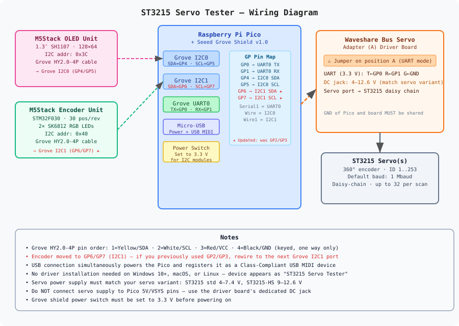
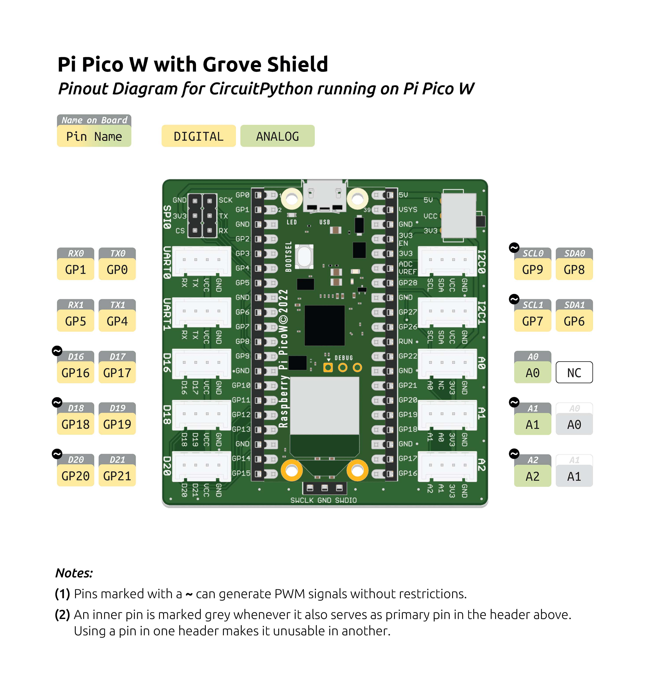

# Servo Tester — ST3215 · SC09 · DXL MX (P1.0) · DXL X (P2.0) · RC PWM

A standalone servo configuration, control, and MIDI integration tool for **Waveshare ST3215**, **Feetech SC09 (SCS)**, **Dynamixel MX series (Protocol 1.0)**, **Dynamixel X series (Protocol 2.0)** serial bus servos, and **standard RC hobby servos** via 6-channel PWM.

Built on a **Raspberry Pi Pico (RP2040)** with a rotary encoder knob, OLED display, and USB MIDI — no PC required once flashed.

Designed for robotics and kinetic art: record arm motion as MIDI into a DAW, then play it back on the arm with full bidirectional CC integration.



---

## Table of Contents

1. [Features](#features)
2. [Hardware](#hardware)
   - [Build Environments](#build-environments-overview)
   - [Bill of Materials](#bill-of-materials)
   - [Hookup Tables](#hookup-tables)
   - [Wiring Notes](#wiring-notes)
3. [Supported Servo Protocols](#supported-servo-protocols)
4. [Screen Reference](#screen-reference)
5. [Software Setup](#software-setup)
6. [Hardware Setup](#hardware-setup)
7. [Usage Guide](#usage-guide)
   - [First Boot](#first-boot)
   - [Protocol Selection](#protocol-selection)
   - [Bus Scanning](#bus-scanning)
   - [Live Control](#live-control)
   - [Configuration](#configuration)
   - [MIDI Mode](#midi-mode)
   - [MIDI Run Modes](#midi-run-modes)
   - [Flash Diagnostics](#flash-diagnostics)
8. [MIDI Reference](#midi-reference)
9. [Persistent Storage](#persistent-storage)
10. [Servo Configuration Parameters](#servo-configuration-parameters)
11. [Fault Codes](#fault-codes)
12. [Serial Debug Commands](#serial-debug-commands)
13. [Project File Structure](#project-file-structure)
14. [External Documentation](#external-documentation)
15. [Troubleshooting](#troubleshooting)

---

## Features

### Servo Control
- **Five protocols** — ST3215 (STS), SC09 (SCS), Dynamixel Protocol 1.0 (MX series RS-485), Dynamixel Protocol 2.0 (XH/XM/XD series RS-485), and standard RC PWM (6 fixed channels); switchable at runtime from the menu
- **Multi-baud bus scan** — scan at any baud rate from the protocol's baud table, or run *Scan All* to sweep all rates and find servos regardless of their current setting (not applicable to RC PWM — see below)
- **Scan abort** — long-press during any scan to stop early and keep found servos
- **Live control** — real-time position, speed, and acceleration adjustment; position range and degree/µs display automatically match the active protocol
- **Full EPROM configuration** — Servo ID, Min/Max limits, Torque limit, Center offset, Mode (Servo/Wheel), Baud rate; changes staged and written on explicit Save
- **Wheel mode safety warning** — hardware-damage warning screen before enabling continuous rotation
- **Servo info** — two-page info screen: runtime values (position, voltage, temperature) and fault status (load, current, decoded fault flags)

### RC PWM mode (6 channels, no bus)
- **No scan needed** — all 6 channels are always present as IDs 1–6 the moment the protocol is selected
- **No EEPROM/configuration** — RC servos have nothing to configure; the Scan Bus, Configure, and Save Changes menu items show a brief notice instead of entering those screens
- **Torque = attach/detach** — enabling torque starts outputting pulses at the current position; disabling torque stops the pulse train entirely (most RC servos go limp, matching `Servo.detach()` behaviour from the Arduino Servo library)
- **800–2200 µs pulse range**, 50 Hz frame rate, native RP2040 PWM hardware (no software bit-banging, no CPU load)
- **Live Control shows actual microseconds** (not an abstract 0–4095 unit) and maps to a 0–180° angle display
- Torque auto-enabled on all 6 channels immediately when RC PWM is selected — no extra step needed before the arm responds

### MIDI
- **USB MIDI device** — appears as Class-Compliant MIDI on Windows/macOS/Linux with no driver needed
- **USB CDC serial simultaneously** — debug output and serial commands available alongside MIDI on the same USB connection
- **Per-servo CC mapping** — assign any CC number and MIDI channel to each detected servo or RC PWM channel
- **Bidirectional** — inbound CC moves servos; outgoing CC reflects actual position in real time (~21 Hz per servo with 6 servos at 1 Mbaud; RC PWM has no position feedback so TX reflects last commanded value)
- **Inverted mapping** — optionally invert the CC→position scaling per servo
- **IIR smoothing filter** — per-servo adjustable low-pass filter (0=off, 127=very slow); filter continues converging to the final target after the last CC message arrives, so the servo always reaches its true endpoint
- **Global CC parameters** — Speed, Acceleration, and Smoothing each mappable as MIDI CC; changing speed/acc does not disrupt servo positions
- **Jump filter** — global threshold (0–64, default off) that rejects sudden CC jumps larger than N steps; blocks Ableton's default CC=0 on empty tracks while letting gradual movements pass through unchanged
- **MIDI run modes** — three modes selectable live during MIDI Run:
  - **Send+Recv** — full bidirectional (default)
  - **Send only** — arm sends positions for DAW recording; torque automatically disabled so the arm moves freely by hand
  - **Recv only** — arm executes DAW playback; suppresses outgoing CC to prevent feedback loops
- **MIDI monitor** — scrollable ring buffer showing last 4 messages: CC, Note On/Off, Pitch Bend, Program Change, Aftertouch
- **MIDI panic** — sends CC 121 + CC 123 on all 16 channels

### System
- **Persistent configuration** — servo list, protocol, scan baud, torque, speed, acc, all MIDI bindings, run mode, jump filter, and SC09/STS sub-mode saved to LittleFS; restored on boot without rescanning
- **Flash diagnostics screen** — inspect LittleFS health, file size, magic/version check, saved servo/MIDI counts
- **Status LED** — amber during boot, green when idle, amber when MIDI active (XIAO build only)
- **Boot diagnostics** — serial terminal reports `oledOk`, `encoderOk`, and (on the custom board) `SERVO_DE_PIN` at boot for hardware fault diagnosis
- **I2C bus recovery** — clocks SCL 9 times before `Wire.begin()` to clear any device left mid-transaction by a previous reset, preventing I2C hangs on boot

---

## Hardware

### Build Environments Overview

Three hardware configurations are supported, selected at compile time via the PlatformIO environment. All three use the **M5Stack Unit Encoder** (single knob).

| Environment | Board | Display | Encoder | I2C layout | Servo bus |
|---|---|---|---|---|---|
| `env:pico` | Raspberry Pi Pico + Grove Shield | SH1107, 64×128 | I2C1 (GP6/GP7) | Two independent buses | Auto-direction adapter, no DE pin |
| `env:xiao_rp2040` | Seeed XIAO RP2040 + Expansion Board | SSD1306, 128×64 | I2C0 (shared with OLED) | Single shared bus | Auto-direction adapter, no DE pin |
| `env:pico_rs485` | [picoST3215led boardV2.0](https://github.com/edwindertien/animatronics/tree/main/picoST3215led/boardV2.0) (TTL) or [picoServo boardV1.0](https://github.com/edwindertien/animatronics/tree/main/picoServo/boardV1.0) (RS485) | SH1107, 64×128 | I2C0 (shared with OLED, GP4/GP5) | Single shared bus | **TTL (boardV2.0) or wired RS485 with DE/RE on GP2 (boardV1.0)** |

All three also support **RC PWM mode** on 6 dedicated GPIO pins (see table below) — these pins are completely separate from the I2C, UART, and USB host pins on each board, chosen specifically to avoid conflicts.

| Environment | RC PWM pins |
|---|---|
| `env:pico` | GP10, GP11, GP12, GP13, GP18, GP19 |
| `env:xiao_rp2040` | GP2, GP8, GP9, GP10, GP28, GP29 |
| `env:pico_rs485` | GP6, GP7, GP8, GP26, GP27, GP28 |

### Bill of Materials (Pico + Grove Shield build)

| # | Part | Notes |
|---|------|-------|
| 1 | **Raspberry Pi Pico** (RP2040) | Headers pre-soldered recommended |
| 2 | **Grove Shield for Pi Pico v1.0** | Seeed Studio |
| 3 | **M5Stack Unit OLED 1.3″** (SH1107, 128×64) | I2C address 0x3C |
| 4 | **M5Stack Unit Encoder** (STM32F030, 30 pos/rev, RGB LED) | I2C address 0x40 |
| 5 | **RS-485 / TTL adapter board** | Auto-direction (TX-controlled); no DE/RE pin needed |
| 6 | Servos: ST3215, SC09, MX-28R/64R, XH/XM series, or standard RC servos | One or more, daisy-chained on same bus (or 6 individual RC channels) |
| 7 | DC supply for servos (voltage per servo spec) | Shared GND with Pico mandatory |



### Custom boards (env:pico_rs485)

Two community-designed boards have been tested with this firmware under the `env:pico_rs485` environment (same firmware binary — the difference is purely the servo-bus driver chip on the PCB):

**[picoST3215led boardV2.0](https://github.com/edwindertien/animatronics/tree/main/picoST3215led/boardV2.0)** — TTL output driver (no DE/RE direction pin; `SERVO_DE_PIN = -1` behaviour). Confirmed working with:
- ST3215 (native TTL)
- SC09 (native TTL)
- DXL1 / DXL2 (native TTL)
- DXL1 / DXL2 over **RS485**, via a [Robotis bi-directional TTL↔RS485 converter](https://emanual.robotis.com/docs/en/parts/interface/dxl_bridge/) bridging the board's TTL output to an RS485 Dynamixel bus

**[picoServo boardV1.0](https://github.com/edwindertien/animatronics/tree/main/picoServo/boardV1.0)** — native RS485 transceiver with wired DE/RE direction control on GP2 (`SERVO_DE_PIN = 2`). Confirmed working with:
- RS485 Dynamixel servos directly (no bridge needed)
- ST3215 / SC09 / DXL1 / DXL2 in their native **TTL** form, via the same [Robotis bi-directional TTL↔RS485 converter](https://emanual.robotis.com/docs/en/parts/interface/dxl_bridge/) bridging the board's RS485 output down to TTL

> **Firmware note:** both boards currently build under the single `env:pico_rs485` environment, which sets `SERVO_DE_PIN = 2` in `config.h`. On **picoServo boardV1.0** (RS485) this pin genuinely drives the transceiver's DE/RE line. On **picoST3215led boardV2.0** (TTL) GP2 is simply unused by the servo hardware — the firmware still toggles it, but since nothing is wired to it on that board, this is harmless. If GP2 happens to be used for something else on a future TTL board revision, split this into a separate `env:pico_ttl` with `SERVO_DE_PIN = -1`.

Both boards share a single I2C bus on GP4/GP5 for OLED and encoder, and break out 6 free GPIO for RC PWM servo headers. Use a passive Grove hub freely on this I2C bus — passive 4-in-1 hubs are just parallel wiring and behave identically to a direct connection. Long I2C wire runs benefit from external pull-up resistors (the onboard pull-ups can be marginal at 400 kHz over longer cable lengths).

> **Choosing a converter direction:** the Robotis bridge is bidirectional, so either board can reach the "other" electrical standard — TTL boardV2.0 can still drive an RS485 bus, and RS485 boardV1.0 can still drive TTL-only servos (ST3215/SC09/TTL-DXL). Pick whichever board matches your *primary* servo population and bridge the exception.

---

### Hookup Tables

**Pico + Grove Shield:**

| Signal | Pico GPIO | Grove Port | Connects to |
|--------|-----------|------------|-------------|
| OLED SDA | **GP4** | I2C0 | M5Stack OLED — SDA |
| OLED SCL | **GP5** | I2C0 | M5Stack OLED — SCL |
| Encoder SDA | **GP6** | I2C1 | M5Stack Encoder — SDA |
| Encoder SCL | **GP7** | I2C1 | M5Stack Encoder — SCL |
| Servo UART TX | **GP0** | UART0 T | RS-485 adapter — T |
| Servo UART RX | **GP1** | UART0 R | RS-485 adapter — R |
| Common GND | GND | Any GND | RS-485 adapter — G |

**Custom RS485 board (env:pico_rs485):**

| Signal | Pico GPIO | Connects to |
|--------|-----------|-------------|
| OLED + Encoder SDA | **GP4** | Shared I2C bus |
| OLED + Encoder SCL | **GP5** | Shared I2C bus |
| Servo UART TX | **GP0** | RS485 transceiver — DI |
| Servo UART RX | **GP1** | RS485 transceiver — RO |
| Servo DE/RE | **GP2** | RS485 transceiver — DE & /RE tied together |
| RC PWM ch 1–6 | **GP6, GP7, GP8, GP26, GP27, GP28** | RC servo signal pins |

**I2C addresses (all boards):**

| Device | Address |
|--------|---------|
| M5Stack OLED (SH1107 or SSD1306 depending on build) | `0x3C` |
| M5Stack Encoder | `0x40` |

> **XIAO note:** On the XIAO expansion board the UART Grove port (GP0/GP1) and I2C Grove port (GP6/GP7) look identical and sit next to each other. Always plug the servo adapter into the port labelled **UART**, not I2C.

---

### Wiring Notes

**Grove Shield power switch** — set to **3.3 V** before connecting. Both OLED and Encoder are 3.3 V devices.

**Auto-direction RS-485/TTL adapters** (Pico Grove and XIAO builds) — no separate DE/RE pin. The adapter switches TX/RX direction based on the UART TX line. TX bytes are echoed back to RX; the firmware handles echo cancellation automatically for ST3215/SC09 (`EchoSMS_STS::wFlushSCS()`) and DXL1/DXL2 (`drainEcho()`).

**Wired RS485 with DE/RE** (custom board) — GP2 drives DE/RE directly. The firmware asserts GP2 HIGH before every TX packet and releases it LOW after, with a baud-derived guard delay. No echo is produced since the transceiver blocks RX during TX.

**ST3215 at 5V on a Dynamixel-spec TTL converter:** the ST3215/SC09 are 3.3V logic devices. Some Robotis-style TTL converters pull the bus up to 5V. This is electrically marginal — the Pico's 3.3V GPIO is technically out of spec seeing 5V on RX. For permanent setups, add a 3.3V Zener (e.g. BZX84-C3V3) between the data line and the Pico RX pin (cathode to data line, anode to GND) to clamp the voltage safely.

**Shared ground is mandatory** — servo power supply, RS-485 adapter, and Pico must share a common GND.

**USB carries both MIDI and serial** — the Pico enumerates as a composite device: USB MIDI + USB CDC serial. Connect a serial terminal at 115200 baud to see debug output and send commands while MIDI remains active.

**I2C clock** — all environments run at 400 kHz by default (`HW::ENC_I2C_HZ` in `config.h`). For long wire runs with marginal pull-ups, reduce to 100 kHz as a quick fix before adding physical pull-up resistors.

---

## Supported Servo Protocols

Select the active protocol from **Home → Protocol**. The protocol, last-used baud index, and (for ST3215/SC09) the sub-mode are persisted across power cycles.

### ST3215 / STS (default)
Waveshare/Feetech serial bus servos. Uses the SCServo library with `EchoSMS_STS` subclass that drains the TX echo before reading responses (auto-direction builds) or asserts/releases the DE pin (wired RS485 builds). Factory baud: **1,000,000**. Position range: **0–4095**.

| Index | Baud |
|---|---|
| 0 | 1,000,000 (factory default) |
| 1 | 500,000 |
| 2 | 250,000 |
| 3 | 128,000 |
| 4 | 115,200 |
| 5 | 76,800 |
| 6 | 57,600 |
| 7 | 38,400 |

### SC09 / SCS
Older Feetech serial bus servos (SC09, SC15, SC16 family). Reuses the same `ST3215Bus` driver with a runtime `scsMode` flag — this is **not** a separate protocol slot in `BusProtocol`, but its own enum value (`BusProtocol::SC09`) that automatically configures the underlying bus for SCS-specific quirks. Position range: **0–1023** (10-bit). Same baud table as ST3215.

Key differences from ST3215, all handled transparently by the firmware:
- **Byte order**: SCSCL uses big-endian word encoding (`End=1`); SMS_STS/ST3215 uses little-endian (`End=0`). `setScsMode()` toggles `_servo.End` immediately.
- **EEPROM lock register**: address 48 on SC09 vs address 55 on ST3215. Using the wrong address leaves EEPROM locked and writes silently fail to persist.
- **Max-angle-limit EEPROM commit bug**: `writeWord()`'s single 2-byte packet write to the max-limit register (11/12) does not reliably commit on SC09 hardware, despite returning a successful Ack. The firmware writes min and max limits as four separate single-byte writes on SC09 to work around this — see [context.md](context.md) for the full diagnostic trail.
- **No torque-limit, center-offset, or mode registers** — these Configure rows are silently skipped (no-op) when in SC09 mode.

### DXL MX — Protocol 1.0 (MX-28, MX-64, MX-106)
Dynamixel RS-485 MX series. Factory baud: **57,142** (register 34; Dynamixel's nominal "57600" = 2,000,000/35).

| Index | Actual baud | DXL register |
|---|---|---|
| 0 | 9,615 | 207 |
| 1 | 19,230 | 103 |
| 2 | **57,142** | **34** (factory default) |
| 3 | 100,000 | 19 |
| 4 | 117,647 | 16 |
| 5 | 200,000 | 9 |
| 6 | 250,000 | 7 |
| 7 | 1,000,000 | 1 |

> **Note:** Dynamixel Wizard shows "57600" but the actual UART rate is 57,142. The firmware uses the correct value to avoid framing errors.

### DXL X — Protocol 2.0 (XH430, XM430, XD430, XH540…)
Dynamixel RS-485 X series. Factory baud: **57,600** (register index 1).

| Index | Baud |
|---|---|
| 0 | 9,600 |
| 1 | **57,600** (factory default) |
| 2 | 115,200 |
| 3 | 1,000,000 |
| 4 | 2,000,000 |
| 5 | 3,000,000 |
| 6 | 4,000,000 |
| 7 | 4,500,000 |

> **DXL2 torque behaviour:** The XH/XM series locks EEPROM registers when torque is enabled. The firmware automatically disables torque when entering the Configure menu, and always starts Live Control with torque off.

### RC PWM (6 channels, no protocol)
Standard RC hobby servos on 50 Hz PWM, 800–2200 µs pulse width. No serial bus, no scan — the 6 channels (IDs 1–6) are populated instantly when the protocol is selected, with torque (PWM output) enabled automatically on all channels. See [Features](#rc-pwm-mode-6-channels-no-bus) above for full behaviour.

---

## Screen Reference

### Navigation Controls

| Action | Effect |
|--------|--------|
| **Turn knob** | Scroll menu / increment or decrement value when editing |
| **Short press** | Select item / enter edit mode / confirm edit |
| **Long press** | Cancel edit / go back to Home |

---

### Screen Descriptions

| Screen | Access | Purpose |
|--------|--------|---------|
| **Home** | Boot / Long press from anywhere | Top-level menu (title: "Bus Servo Ctrl") |
| **Select Protocol** | Home → Protocol | Choose ST3215 / SC09 / DXL MX / DXL X / RC PWM — scrollable, 4 rows visible |
| **Scan Baud Select** | Home → Scan Bus | Choose baud rate or Scan All (not shown for RC PWM) |
| **Scanning…** | After selecting single baud | Progress bar ID 0–253; Long press = stop early |
| **Scan All Bauds** | Scan Baud Select → Scan All | Dual progress: outer=baud, inner=ID |
| **Select Servo** | Home → Select Servo | Scroll found IDs; short press to make active |
| **Live Control** | Home → Live Control | Real-time: Torque · Position · Speed · Acceleration; range and units match active protocol |
| **Servo Info** | Home → Servo Info | Page 1: Online/Position/Voltage/Temp |
| **Faults** | Servo Info → Short press | Load %, Current (mA), decoded fault flags |
| **Configure** | Home → Configure | Edit EPROM parameters (not shown for RC PWM) |
| **⚠ Wheel Mode** | Configure → Mode | Safety confirmation before enabling continuous rotation |
| **Confirm Save?** | Home → Save Changes | Summary of staged config; No / Yes (not shown for RC PWM) |
| **Save Result** | After confirming save | OK or failure message |
| **MIDI Setup** | Home → MIDI Mode | Assign CC/channel/invert/smooth per servo; set jump filter |
| **MIDI Run** | MIDI Setup → Run | Live TX/RX indicators; Mode · Monitor · Panic rows |
| **MIDI Monitor** | MIDI Run → MIDI Monitor | Last 4 received MIDI messages |
| **Flash Diag** | Home → Flash Diag | LittleFS health, file size, saved counts |

---

## Software Setup

### Prerequisites

| Tool | Notes |
|------|-------|
| **VSCode** | [code.visualstudio.com](https://code.visualstudio.com) |
| **PlatformIO IDE extension** | Install from VSCode Extensions marketplace |

### Build Environments

```ini
[platformio]
default_envs = pico

[env:pico]          ; Raspberry Pi Pico + Grove Shield
board = pico

[env:xiao_rp2040]   ; Seeed XIAO RP2040 + Expansion Board
board = seeed_xiao_rp2040

[env:pico_rs485]    ; Custom board — wired RS485, shared I2C, RC PWM headers
board = pico
```

Select the active environment in VS Code's bottom status bar, or:
```
pio run -e pico -t upload
pio run -e pico_rs485 -t upload
```

### Project Setup in VSCode / PlatformIO

1. Open the project folder (`File → Open Folder` → directory with `platformio.ini`).
2. PlatformIO auto-detects the project and installs dependencies automatically.
3. Library dependencies:

```ini
lib_deps =
    https://github.com/workloads/scservo.git
    adafruit/Adafruit GFX Library @ ^1.11.9
    adafruit/Adafruit SH110X    @ ^2.1.10
    adafruit/Adafruit SSD1306   @ ^2.5.9
    adafruit/Adafruit TinyUSB Library @ ^3.1.0
    fortyseveneffects/MIDI Library @ ^5.0.2
```

4. Platform: **Earle Philhower RP2040 Arduino core** via maxgerhardt's platform wrapper.
5. All environments run at **120 MHz**.
6. USB enumerates as composite MIDI + CDC via build flags:
```ini
build_flags = -D USE_TINYUSB -D CFG_TUD_CDC=1 -D PICO_STDIO_UART=0
```
7. RC PWM uses the native RP2040 hardware PWM API (`hardware/pwm.h`) — no extra library dependency required, it's part of the Pico SDK bundled with the Earle Philhower core.

### Building and Flashing

**Method 1 — PlatformIO toolbar**
1. Select the correct environment in the bottom status bar.
2. Click **✓ Build**.
3. Hold **BOOTSEL** on the Pico, plug in USB, release.
4. Click **→ Upload**.

**Method 2 — Manual drag-and-drop**
1. Build → `.pio/build/<env>/firmware.uf2`
2. Enter BOOTSEL mode; copy the `.uf2` to the `RPI-RP2` drive.

---

## Hardware Setup

1. Seat the Pico on the Grove Shield (USB connector toward the shield edge) — or mount on the custom RS485 board.
2. **Set Grove Shield power switch to 3.3 V** (Pico Grove build only).
3. Connect OLED and Encoder per the [hookup table](#hookup-tables) for your build.
4. Wire the servo bus: auto-direction adapter (`GP0→T`, `GP1→R`, `GND→G`) or wired RS485 transceiver (`GP0→DI`, `GP1→RO`, `GP2→DE/RE`, `GND→GND`).
5. For RC PWM: wire up to 6 standard servos to the dedicated GPIO pins for your build (see [pin table](#build-environments-overview)).
6. Power the servos from a suitable DC supply, sharing ground with the Pico.
7. Power the Pico via USB.

---

## Usage Guide

### First Boot

On first boot with no saved state the device scans at the protocol's default baud. After scanning, all state is saved to LittleFS. Subsequent boots restore the saved servo list, MIDI bindings, and run mode without rescanning.

The OLED shows `"Restored — N servo(s)"` on successful load, or `"Scanning bus..."` on a fresh flash.

---

### Protocol Selection

**Home → Protocol**

Turn to scroll through `ST3215 / STS`, `SC09 / SCS`, `DXL MX (P1.0)`, `DXL X (P2.0)`, `RC PWM (6ch)`. The list scrolls (4 rows visible at a time) to keep the bottom row clear of the footer text, with headroom for future protocols. Short press to apply.

- **ST3215 / SC09 / DXL1 / DXL2**: switches the bus driver, resets the baud index to that protocol's factory default, and prompts for a scan.
- **RC PWM**: no scan needed — all 6 channels populate instantly, torque enables automatically, and the screen returns to Home after a brief confirmation.

---

### Bus Scanning

**Home → Scan Bus → Scan Baud Select** *(not available in RC PWM mode)*

- **Single baud scan** — sweeps IDs 0–253 at the selected rate.
- **Scan All** — iterates every baud rate in the protocol's table. Dual progress bars show baud step and ID sweep.
- **Long press during scan** — stops early, keeps servos found so far.

After scanning, the first found servo becomes active and its EPROM config is loaded.

---

### Live Control

**Home → Live Control**

Four rows — short press enters edit, turn to change, short press to confirm, long press to cancel:

| Row | Range | Step | Notes |
|-----|-------|------|-------|
| Torque | ON / OFF | toggle | Immediately sent to servo. For RC PWM: ON=attach (pulses start), OFF=detach (pulses stop) |
| Position (T:) | protocol-dependent | 8 | ST3215/DXL: 0–4095. SC09: 0–1023. RC PWM: 800–2200 (µs) |
| Speed (Spd:) | 0–4095 | 10 | Ignored by RC PWM (no speed control on raw PWM) |
| Acceleration (Acc:) | 0–254 | 1 | Ignored by RC PWM |

A position bar shows target (thin line) vs actual (filled block) within min–max limits, with hatched areas outside servo limits. The bar's full width is always used regardless of the protocol's actual numeric range — for RC PWM this means 800µs sits at the far left and 2200µs at the far right, not offset into the bar.

The degree readout shows **0–360°** for ST3215/SC09/DXL1/DXL2, and **0–180°** for RC PWM, scaled correctly across each protocol's actual position range.

> **DXL2 note:** Live Control always starts with **Torque OFF**. Enable it explicitly before the servo will move.
>
> **RC PWM note:** Torque is already ON (attached) the moment the protocol is selected — no extra step needed.

---

### Configuration

**Home → Configure** *(not available in RC PWM mode)*

Up to 8 rows, scrollable. Short press to edit, turn to change, short press to confirm, long press to cancel.

| Row | Parameter | Range | Step | Visible for |
|-----|-----------|-------|------|-------------|
| NewID | Servo ID | 0–253 | 1 | All |
| Min | Min position limit | 0–posMax | 8 | All |
| Max | Max position limit | 0–posMax | 8 | All |
| TrqLim | Torque limit | 0–1000 | 10 | All |
| Offset | Center offset | −2047..+2047 | 4 | All |
| Mode | Servo / Wheel | toggle | — | All |
| Baud | Baud rate index | 0–7 | 1 | All |
| Type | STS/3215 ↔ SCS/SC09 | toggle | — | **ST3215 and SC09 only** |

Changes are **staged** — written to servo EPROM only via **Home → Save Changes**. A `*` in the header indicates unsaved changes.

> **Type row:** normally you never need to touch this — selecting ST3215 or SC09 from the Protocol menu sets it automatically. It's kept as a manual override for edge cases. It is hidden entirely for DXL1/DXL2.
>
> **DXL2 note:** Entering Configure with torque ON automatically disables torque and shows a notice. The XH/XM series silently ignores all EEPROM writes while torque is enabled.
>
> **SC09 note:** TrqLim, Offset, and Mode rows are accepted in the UI but the underlying save is a silent no-op — the SC09 control table has no registers for these. Min/Max are written as four individual single-byte EEPROM writes rather than two word writes (see [context.md](context.md) for why).
>
> **Baud rate change:** After saving, the firmware immediately switches to the new baud and persists the scan baud index so the next scan finds the servo automatically.

---

### MIDI Mode

**Home → MIDI Mode**

The Pico appears as a USB MIDI device in your DAW. No driver needed. Works identically whether the active protocol is a serial bus servo or RC PWM — both populate `_app.ids[]` the same way, so the MIDI binding system is fully protocol-agnostic.

**MIDI Setup screen rows:**

Each servo binding is editable in 4 sequential steps (short press advances through steps, long press cancels):

| Step | Field | Range |
|------|-------|-------|
| 1 | CC number | 0–127 |
| 2 | MIDI channel | 1–16 |
| 3 | Invert | I / - |
| 4 | Smoothing | 0–127 |

Below the servo rows, three global parameter rows:

| Row | Maps to |
|-----|---------|
| **Spd** | Global speed — CC 0–127 → speed 0–4095 (ignored by RC PWM) |
| **Acc** | Global acceleration — CC 0–127 → acc 0–254 (ignored by RC PWM) |
| **Smt** | Global smoothing — sets all per-servo smoothing values |

Then one global filter row:

| Row | Function |
|-----|----------|
| **JmpFlt** | Jump filter threshold (0=off, 1–64). Incoming CC is rejected if it jumps more than this many steps from the last accepted value. Blocks Ableton's default CC=0 on empty/unrecorded tracks. Gradual movements pass through normally. |

Scroll to `>Run<` and short press to enter MIDI Run.

---

### MIDI Run Modes

In **MIDI Run**, scroll to the **Mode** row and short press to cycle through three modes:

| Mode | Behaviour | Typical use |
|------|-----------|-------------|
| **Send+Recv** | Arm sends positions as CC; incoming CC moves arm | Normal real-time control |
| **Send only** | Arm sends positions; incoming CC ignored; **torque disabled automatically** | Hand-drive the arm to record motion into DAW |
| **Recv only** | Arm executes incoming CC; no outgoing CC | Play back recorded DAW animation without feedback |

**Recording workflow (arm → DAW → arm):**

1. Set mode to **Send only** — torque turns off, arm goes limp for free movement
2. Move the arm by hand; DAW records the CC stream
3. Set mode to **Recv only** — arm listens to DAW playback, no CC sent back
4. Play the DAW automation — arm reproduces the recorded motion
5. Use the **Jump filter** (JmpFlt) in MIDI Setup to block CC=0 spikes at the start/end of empty DAW tracks

> **Ableton monitoring note:** Even in Send+Recv mode, feedback loops can be managed in Ableton by disabling input monitoring on the track that drives the arm.
>
> **Torque is not automatically re-enabled** when leaving Send only — re-enable it explicitly in Live Control to avoid a sudden jolt if the arm moved during hand-driven recording.

---

### Flash Diagnostics

**Home → Flash Diag**

```
Flash Diag
FS:OK 2/256K
File:150B exp:150B
Magic:OK
Ver:12 OK exp:12
Srv:6 MIDI:6
```

If `FS:FAIL`: check `board_build.filesystem_size = 256k` in `platformio.ini`.
If `Ver:BAD`: firmware was updated — device rescans once and writes fresh data automatically.

---

## MIDI Reference

### Scaling

**Position → CC (outgoing TX):**
`CC = map(clamp(pos, minLimit, maxLimit), minLimit, maxLimit, 0, 127)`
If inverted: `CC = 127 − CC`

**CC → Position (incoming RX):**
If inverted: `CC = 127 − CC`
`pos = map(CC, 0, 127, minLimit, maxLimit)`

**Global speed:** `speed = map(CC, 0, 127, 0, 4095)`
**Global acc:** `acc = map(CC, 0, 127, 0, 254)`

### Smoothing Filter

IIR (exponential moving average): `smoothPos = α × rawTarget + (1−α) × smoothPos`
where `α = (128 − smoothing) / 128`

| Smoothing | α | Behaviour |
|-----------|---|-----------|
| 0 | 1.0 | Instant — no filtering |
| 64 | 0.5 | Moderate lag |
| 127 | ≈0.008 | Very slow |

The filter keeps advancing toward the last target even after CC messages stop arriving (driven by `lastRawTarget`, refreshed every RX tick), so the servo always reaches its final position.

### Jump Filter

`abs(newCC − lastAcceptedCC) > jumpFilter` → CC rejected.
`jumpFilter = 0` → disabled (accept all). `jumpFilter = 64` → maximum filtering.
A value of 20–30 is a good starting point for blocking Ableton empty-track CC=0 spikes.

### Update Rates (6 servos, 1 Mbaud ST3215)

| Path | Interval | Rate per servo |
|------|----------|----------------|
| TX (outgoing CC) | 8 ms per servo polled | ~21 Hz per servo |
| RX (incoming CC applied) | 8 ms tick | ~125 Hz |

RC PWM channels have no bus round-trip cost (a single hardware register write per `setPosition()`), so they never become the bottleneck even at full 6-channel MIDI binding.

---

## Persistent Storage

Saved to **LittleFS** (`/config.bin`, 256 KB reserved). Written atomically via temp-file rename.

| Data | Save trigger |
|------|-------------|
| Servo ID list + active index | After every scan (or instantly for RC PWM protocol selection) |
| Active protocol | On protocol switch |
| Scan baud index | After scan or baud-change save |
| Torque on/off | When toggled in Live Control |
| Speed, Acceleration | When changed in Live Control or via MIDI |
| All MIDI bindings (CC, channel, invert, smoothing) | When leaving MIDI Setup or entering Run |
| MIDI run mode (Send+Recv / Send only / Recv only) | When mode changed in MIDI Run |
| Jump filter value | When edited in MIDI Setup |
| SC09/STS sub-mode (`scsMode`) | On protocol switch and Configure Type-row toggle |

**Not saved in flash** (lives in servo EPROM, not applicable to RC PWM): Min/Max limits, Torque limit, Center offset, Mode, Baud rate, Servo ID. Written by **Save Changes**.

**Current version:** `PERSIST_VERSION = 12`. Version mismatch triggers automatic rescan and fresh save.

---

## Servo Configuration Parameters

### ST3215 / STS

| Parameter | Address | Range |
|-----------|---------|-------|
| Servo ID | `SMS_STS_ID` (0x05) | 0–253 |
| Baud Rate | `SMS_STS_BAUD_RATE` (0x06) | 0–7 (index) |
| Min Limit | `SMS_STS_MIN_ANGLE_LIMIT_L` (0x09) | 0–4095 |
| Max Limit | `SMS_STS_MAX_ANGLE_LIMIT_L` (0x0B) | 0–4095 |
| Mode | `SMS_STS_MODE` (0x0D) | 0=Servo, 1=Wheel |
| Center Offset | `SMS_STS_OFS_L` (0x1F) | −2047..+2047 |
| Torque Limit | `SMS_STS_TORQUE_LIMIT_L` (0x23) | 0–1000 |
| EEPROM Lock | 55 (0x37) | 0=unlocked, 1=locked |

### SC09 / SCS

| Parameter | Address | Range | Notes |
|-----------|---------|-------|-------|
| Servo ID | 5 | 0–253 | Same as ST3215 |
| Baud Rate | 6 | 0–7 (index) | Same as ST3215 |
| Min Limit | 9–10 (L/H) | 0–1023 | Written as 2 separate `writeByte()` calls |
| Max Limit | 11–12 (L/H) | 0–1023 | Written as 2 separate `writeByte()` calls — `writeWord()` does not reliably commit here |
| EEPROM Lock | **48** (0x30) | 0=unlocked, 1=locked | **Different from ST3215's register 55** |
| Torque Limit | — | n/a | Not present on SC09 control table |
| Center Offset | — | n/a | Not present on SC09 control table |
| Mode | — | n/a | Not present on SC09 control table |

### DXL MX — Protocol 1.0

| Parameter | Address | Range |
|-----------|---------|-------|
| Servo ID | reg 3 | 0–253 |
| Baud Rate | reg 4 | formula: `2,000,000 / (reg+1)` |
| CW Angle Limit | reg 6 (word) | 0–4095 |
| CCW Angle Limit | reg 8 (word) | 0–4095 |
| Drive Mode | reg 10 | bit0: 0=joint, 1=wheel |
| Max Torque | reg 14 (word) | 0–1023 |
| Torque Enable | reg 24 | 0/1 |

### DXL X — Protocol 2.0

| Parameter | Address | Range |
|-----------|---------|-------|
| Servo ID | 7 | 0–252 |
| Baud Rate | 8 | 0–7 (index) |
| Drive Mode | 10 | — |
| Operating Mode | 11 | 3=Position, 1=Velocity, 16=Extended |
| Homing Offset | 20 (dword) | signed |
| Current Limit | 38 (word) | 0–1193 (unit: 2.69 mA) |
| Min Position Limit | 52 (dword) | 0–4095 |
| Max Position Limit | 48 (dword) | 0–4095 |
| Torque Enable | 64 | 0/1 — **must be 0 to write EEPROM** |
| Present Position | 132 (dword) | 0–4095 |

### RC PWM

No EEPROM, no control table. Position is sent directly as a microsecond pulse width (800–2200) via `setPosition()`. Torque enable/disable is handled in software by starting/stopping the PWM output.

---

## Fault Codes

| Bit | Fault | ST3215 / SC09 | DXL1 (MX) | DXL2 (X) |
|-----|-------|--------|-----------|----------|
| 0 | Voltage | reg 65 bit 0 | err bit 0 | hw_err bit 0 |
| 1 | Sensor | reg 65 bit 1 | err bit 3 | hw_err bit 3 |
| 2 | Overtemp | reg 65 bit 2 | err bit 2 | hw_err bit 2 |
| 3 | Overcurrent | reg 65 bit 3 | err bit 1 | hw_err bit 4 |
| 4 | Angle | reg 65 bit 4 | — | — |
| 5 | Overload | reg 65 bit 5 | err bit 5 | hw_err bit 5 |

RC PWM has no fault reporting (no feedback wire) — the Faults screen shows placeholder/unavailable values.

---

## Serial Debug Commands

Connect a serial terminal to the USB CDC port at **115200 baud**. All commands are available alongside MIDI.

| Command | Action |
|---------|--------|
| `p` | DXL2 raw ping ID=1 @ 57600 |
| `b` | DXL2 broadcast ping @ 57600 |
| `d` | DXL1 ping ID=1 via `dxl1Bus` @ 57142 (driver-level, with telemetry) |
| `e` | DXL1 raw loopback test @ 57142 (buffered capture, µs timestamps); also asserts/releases the DE pin if `SERVO_DE_PIN >= 0` |
| `a` | DXL2 raw ping ID=1 on all baud rates (buffered capture, µs timestamps) |
| `w` | DXL2 exact Wizard ping @ 1Mbaud — hardcoded `FF FF FD 00 01 03 00 01 19 4E`; also asserts/releases the DE pin if wired |
| `x` | DE-pin loopback diagnostic: toggles GP2 HIGH, sends `0xAA`, checks it echoes on RX; then confirms DE=LOW correctly blocks TX. Use this first when bringing up a new wired-RS485 board |
| `i` | I2C bus scan on Wire (GP4/GP5 or board-specific) — lists every responding address; use when `oledOk=NO` to find the actual OLED/encoder address |
| `m` | SC09 max-limit write diagnostic — uses the currently active servo and baud, pings, reads/writes min & max via both the normal `saveMinMax()` path and raw individual byte writes, and reports every intermediate register value. Built specifically to diagnose the SC09 max-limit EEPROM commit bug (see [context.md](context.md)) |

All debug commands perform servo bus operations **before** printing to serial, so USB CDC blocking never delays the capture window.

---

## Project File Structure

```
servo-tester/
├── platformio.ini
├── README.md
├── context.md                      Developer notes, architecture, bug history
└── src/
    ├── main.cpp                    Hardware init · USB MIDI+CDC · boot sequence
    │                               Serial debug commands · I2C bus recovery
    ├── config.h                    Pin/address constants for all three board variants
    │                               RCPWM_PINS[6] per board · SERVO_DE_PIN per board
    ├── app_state.h                 AppState struct (runtime state)
    ├── model/
    │   └── servo_model.h           BusProtocol enum (5 values) · baud tables
    │                               MidiServoBinding · MidiState · MidiRunMode
    ├── app/
    │   ├── app.h                   App class declaration
    │   └── app.cpp                 State machine · input handlers · scan logic
    │                               MIDI tick · smoothing · jump filter · run modes
    │                               persistence · protocol switch (incl. RC PWM fast-path)
    └── drivers/
        ├── iservo_bus.h            IServoBus pure-virtual interface
        ├── servo_bus.h / .cpp      ST3215/SC09 (EchoSMS_STS + scsMode for dual protocol)
        ├── dxl1_bus.h / .cpp       Dynamixel Protocol 1.0 (MX series RS-485)
        ├── dxl2_bus.h / .cpp       Dynamixel Protocol 2.0 (XH/XM series RS-485)
        ├── rcpwm_bus.h / .cpp      RC PWM servo driver (native RP2040 PWM hardware)
        ├── oled_ui.h / .cpp        OLED rendering (SH1107 + SSD1306, protocol-aware ranges)
        ├── midi_engine.h / .cpp    TinyUSB MIDI · CC/Note/PB/PC/AT callbacks
        ├── persist.h / .cpp        LittleFS save/load · diagnostics
        ├── encoder_unit.h / .cpp   M5Stack Unit Encoder I2C driver
        ├── encoder_8unit.h / .cpp  M5Stack 8-Unit Encoder I2C driver (unused)
        ├── usb_host_engine.h/.cpp  USB Host (PIO-USB, not yet active)
        └── iencoder.h              IEncoder pure-virtual interface
```

---

## External Documentation

| Resource | URL |
|----------|-----|
| Seeed Grove Shield for Pi Pico | https://wiki.seeedstudio.com/Grove_Shield_for_Pi_Pico_V1.0/ |
| M5Stack Unit OLED | https://docs.m5stack.com/en/unit/oled |
| M5Stack Unit Encoder | https://docs.m5stack.com/en/unit/encoder |
| Dynamixel Protocol 1.0 e-manual | https://emanual.robotis.com/docs/en/dxl/protocol1/ |
| Robotis bi-directional TTL↔RS485 bridge | https://emanual.robotis.com/docs/en/parts/interface/dxl_bridge/ |
| picoST3215led boardV2.0 (TTL) | https://github.com/edwindertien/animatronics/tree/main/picoST3215led/boardV2.0 |
| picoServo boardV1.0 (RS485) | https://github.com/edwindertien/animatronics/tree/main/picoServo/boardV1.0 |
| Dynamixel Protocol 2.0 e-manual | https://emanual.robotis.com/docs/en/dxl/protocol2/ |
| MX-28 control table | https://emanual.robotis.com/docs/en/dxl/mx/mx-28/ |
| XH430-W350 control table | https://emanual.robotis.com/docs/en/dxl/x/xh430-w350/ |
| Waveshare ST3215 Servo | https://www.waveshare.com/wiki/ST3215_Servo |
| SCServo Arduino library | https://github.com/workloads/scservo |
| Adafruit TinyUSB library | https://github.com/adafruit/Adafruit_TinyUSB_Arduino |
| fortyseveneffects MIDI Library | https://github.com/FortySevenEffects/arduino_midi_library |
| Earle Philhower RP2040 Arduino core | https://github.com/earlephilhower/arduino-pico |
| RP2040 PWM hardware API (Pico SDK) | https://www.raspberrypi.com/documentation/pico-sdk/hardware.html#group_hardware_pwm |
| Dynamixel2Arduino library (Robotis) | https://github.com/ROBOTIS-GIT/Dynamixel2Arduino |

---

## Troubleshooting

| Symptom | Likely cause | Fix |
|---------|-------------|-----|
| OLED blank | Wrong I2C port/address, or bus stuck | Check hookup table for your build; the `i` command scans for the actual address; I2C recovery runs automatically before `Wire.begin()` |
| Encoder unresponsive | Wrong I2C port | Check hookup table — Pico Grove uses I2C1, all other builds share I2C0 with OLED |
| "No servo" on boot | No saved state, servo not powered | Power servos before Pico; run Scan All |
| ST3215/SC09 scan finds all IDs | TX echo not drained | Fixed — `EchoSMS_STS::wFlushSCS()` drains echo after flush() (auto-direction builds only) |
| ST3215/SC09 scan finds nothing | Wrong baud, wiring, or DE polarity | Check wiring; confirm baud with Scan All; on wired-RS485 boards run the `x` diagnostic |
| Servo found at wrong baud | `Serial1.begin()` not reinitialising | Fixed — `end()+begin()` in all bus drivers |
| SC09 min limit saves, max limit doesn't | `writeWord()` 2-byte packet silently fails to commit on SC09 EEPROM | Fixed — `saveMinMax()` uses 4 separate single-byte writes in SC09 mode |
| SC09 ID/limit writes don't survive power cycle | Wrong EEPROM lock register address used | Fixed — lock register is 48 for SC09, 55 for STS; `LOCK_REG` macro selects the correct one |
| DXL2 config writes ignored | Torque enabled during save | Firmware auto-disables torque on Configure entry |
| DXL2 live control unresponsive | Torque starts OFF for DXL2 | Toggle Torque to ON in Live Control |
| DXL2 CRC mismatch | Wrong CRC table | Fixed — 48 corrected entries at indices 208–255 |
| No USB MIDI in DAW | USB init order | MIDI init is first in setup(); use latest firmware |
| Boot always rescans | Flash not saving | Check Flash Diag; verify `board_build.filesystem_size = 256k`; ensure `persist.save(cfg)` is present (was once accidentally dropped) |
| Flash Diag `Ver:BAD` | Firmware updated | Expected — rescans once, writes new file |
| All servos snap to center on speed CC | Speed CC re-sent `_app.targetPos` to all servos | Fixed — speed/acc CC only updates the value, not positions |
| Arm jittery / unresponsive under MIDI load | IOTimeOut too long; multiple readPosition() calls | Fixed — IOTimeOut=5ms; removed readPosition() from global CC handlers |
| Servo stops ~95% of the way through a move | Smoothing filter not converging | Fixed — `lastRawTarget` keeps filter advancing after last CC |
| MIDI recording shows only 5–7 Hz per servo | TX round-robin 25ms × N servos | Fixed — TX/RX intervals reduced to 8ms |
| Torque still on after switching to Send only | Torque must be disabled for hand recording | Fixed — entering Send only disables torque on all servos |
| RC PWM: no output at all | Torque (PWM output) never explicitly enabled | Fixed — protocol selection now calls `torqueEnable(true)` on all 6 channels automatically |
| RC PWM: Live Control range looks wrong / bottom of bar unusable | `drawPositionBar`/`drawLiveControl` assumed range always starts at 0 | Fixed — `posMin()` threaded through everywhere `posMax()` is used; RC PWM's 800–2200 range now uses the full bar width |
| Custom board: serial comms not working but display/encoder OK | RS485 adapter plugged into the wrong Grove-style port, or insufficient I2C pull-ups over long wires | Check physical wiring; add external I2C pull-up resistors for long runs |
| Protocol/Configure menu text overlaps the footer | Row spacing didn't account for additional protocol entries | Fixed — both menus now scroll (4 rows visible) instead of fitting every item statically |
| DXL1 ping wrong baud | "57600" is actually 57,142 | Firmware uses 57,142 (2,000,000/35) |
| PlatformIO won't find Pico port | Driver not installed | Install Zadig (Windows) or check udev rules (Linux) |

In some cases the Dynamixel Wizard by Robotis can help, but when dealing with mismatched baud rates or return delay settings it is sometimes better to work blind with known values and just send data.

